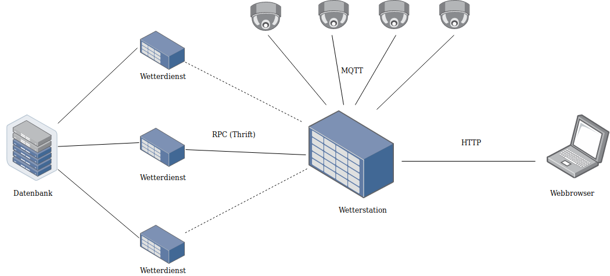

# Verteilte Systeme: Wetterstation

## Allgemein

Ein Wetterstation bekommt Daten von vier Sensoren, diese werden an mehrere Wetterdienste übertragen. 
Über einen Webbrowser können die Sensordaten abgerufen werden.

# Systemdesign

## Sensor
- Jeder Sensor wird unabhängig von den anderen Sensoren gestartet
- Parameterübergabe um die Sensoren unterscheiden zu können
- Sensorarten: Temperatur, Luftfeuchtigkeit, Windstärke, Niederschlag
- Sensordaten werden mittels TCP an einen MQTTBroker gesendet 

## Wetterstation
- Die Wetterstation verbindet sich mit dem MQTTBroker und holt sich die Daten 
- Die Sensorendaten werden an einen Wetterdienst via Thrift gesendet 
- Bei einer HTTP-GET Anfrage Antwortet die Wetterstation mittels HTTP-Response an den Webbrowser
- Unter localhost:PORT + /temp: Temperatur, /humidity: Luftfeuchtigkeit, /rain: Niederschlag, /wind: Windstärke, /last-report: Zugriff auf den Thrift-Server Daten
- Daten vom Wetterdienst holen mittels eines Thrift-Clients
- Wenn ein Wetterdienst ausfällt, kann die Wettersation sich mit einem anderen Wetterdienst verbinden, da es 3 Wetterdienste gibt.


## Wetterdienst
- Server wird vom Apache Thrift autogeneriert
- Der Wetterdienst ist mit einer Datenbank verknüpft
- PostgreSQL als Datenbank verwenden
- Daten, die von der Wetterstationen kommen werden in die Datenbank persistiert
- mindestens 3 Wetterdienste sollen laufen, für die Konsistenz




# Deployment

## Technische Details

- Betriebssystem: Linux, MacOS, Windows
- Verwendete Programmiersprache: Golang
- Verwendete Datenbank: PostgreSQL
- Voraussetzung: mindestens Docker version 18.09.6


### Installing

Mit der _docker-compose.yml_ -Datei werden mehrere Container eingestellt und ihre Beziehungen untereinander definiert. 
Durch den Befehl
```
docker-compose build
```
werden alle Container gebaut.

Ausführen des _run_containers.sh_-Datei werden alle Container gestartet.


```
./run_containers.sh
```
Überprüfe, ob alle Container gestaretet sind mit Hilfe diesem Befehl:

```
docker-compose ps
```
# Tests
Überprüfe, ob die Wetterstation, der Wetterdienste und die Datenbank laufen.

```
docker-compose logs -f
docker-compose logs -f <Container name>
```
## MQTT Verbindungstest 
Überprüfe, ob der MQTTBroker funktioniert. Gib die folgende Zeile in den Webbrowser.

```
localhost:8080
oder
127.0.0.1:8080
```

## HIVEMQ Credentials


```
Benutzername: admin
Passwort: hivemq
```
Überprüfe, ob alle Sensoren mit dem MQTTBroker verbunden sind. Die findet man unter dem Reiter _Clients_.
- client-r
- client-h
- client-w
- client-t 

Überprüfe, ob mehrere Wetterstationen mit dem MQTTBroker verbunden sind.
- station-server-7070
- station-server-7071
- station-server-7072

Überprüfe, ob Sensordaten an die Wetterstation ankommen

```
docker-compose logs -f weather-station-0
docker-compose logs -f weather-station-1
docker-compose logs -f weather-station-2
```

## Konsistenztest

Überprüfe, ob bei einem Ausfall eines Wetterdienstes die Sensordaten auf einem anderen Wetterdienst läuft.


Hierbei schaut man welcher Wetterdienst gerade Daten bekommt, dann stoppt man den einen Container _weather-service-2_:

```
docker-compose logs -f weather-service-2
docker-compose stop weather-service-2
```
Überprüfe, ob der _weather-service-1_ die Daten von der Wetterstation bekommt

```
docker-compose logs -f weather-service-1
```
## HTTP-GET Test
Überprüfe, ob es von der Wetterstation ein HTTP-GET Request ankommt und eine HTTP-Response an den Webbrowser gesendet wird.

```
localhost:7070/last-report
localhost:7070/temp
localhost:7070/humidity
localhost:7070/rain
```
## Datenbankeinträge prüfen
Überprüfe, ob Sensordaten in die Datenbank persistiert wurden.

```
dc exec db psql weather_service
SELECT * FROM report ORDER BY datetime LIMIT 1
```